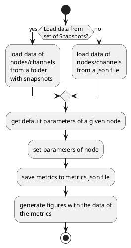

# ln_centrality
LN_Centrality is a simulator that works over the lightning network with the aim to provide a global understanding about its functionality as a network and possible improvement to its technology.
The simulator obtains data from the network topology as the main input for the calculation of centrality metrics. By default, each node provides its own configurations as well as its connection with other nodes through payment channels.
As a premise, the simulator calculates on unrestricted (G<sub>1</sub>) and restricted (G<sub>2</sub>) data from the network to contrast the results with or without restrictions.

Initially, the data is filtered through populate_graphs, which considers only those channels with both policies enabled. A partir de esos datos no restringidos, el simulador calcula todas las métricas. Sin embargo, para calcular las mismas métricas en datos restringidos, el simulador hace uso de get_graphs_restrictions para filtrar los datos de acuerdo con las restricciones definidas. 

Previous to execute the simulator, the reader must fulfill the following [Prerequisites](PREREQUISITES.md) to be able to execute the software properly.

* The section [Libraries](./PREREQUISITES.md#libraries) specifies the several libraries that must be installed beforehand the execution of the simulator
* The section [Additional modules](./PREREQUISITES.md#additional-modules) makes reference to all the modules involved in the simulator and describe its functionality
* The section [Support files](./PREREQUISITES.md#support-files) explains the essential parameters for the proper execution of the simulator.

To sum up, the reader must perform the following steps previously to execute the simulator:

1. Download the [ln_model](https://github.com/StvanLeo/ln_centrality.git) github repository
2. Create a python virtual environment on the same folder as the one that contains the github repository
3. Install the required libraries with their corresponding versions
4. Set the values of the configuration parameters on `parameters.json`
8. Recreate, if necessary, the snapshot file (lnd_describegraph_regtest.json) through the following command on a terminal:
```sh
  root@alice:/# su lnd
  $ lncli --network=regtest describegraph
```

## Test

The following sequence diagram shows the flow of the simulator

<!------>


<!---

--->